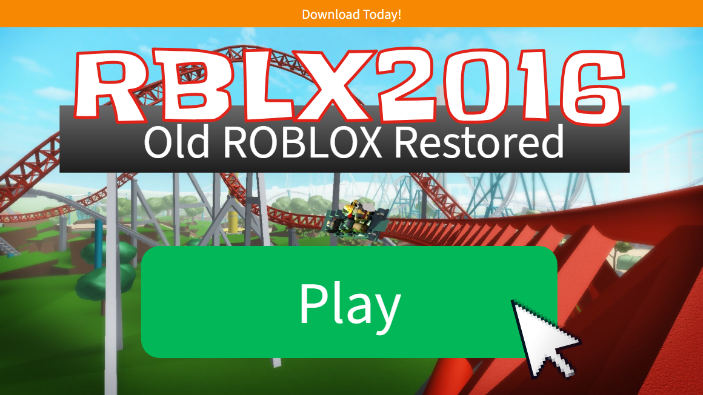

# RBLX2016
This is a userstyle that attempts to transform Modern Roblox's current theme into one reminiscent of the mid-2010s.

    

## Pages

- Home
- Game Sort
- Game Search
- Game Page
- Catalog
- Catalog Item Viewer
- Buy ROBUX

## Installation
Don't have Stylus yet? You can download it here:
- [Chromium-Based Browsers](https://chrome.google.com/webstore/detail/stylus/clngdbkpkpeebahjckkjfobafhncgmne)
- [Firefox](https://addons.mozilla.org/en-US/firefox/addon/styl-us/?utm_source=addons.mozilla.org&utm_medium=referral&utm_content=search)

Once downloaded, go [here](https://userstyles.world/style/27325/). Click the blue "Install" button, and it will lead you to the install page. Then click the gray "Install Style" button on the top-left and you're done. To confirm it's working, you can go to [roblox.com](https://roblox.com/).

## Credits
Things used to make this theme possible:
- [CodePen](https://codepen.io)
- [Wayback Machine](https://web.archive.org)
- [YouTube](https://youtube.com)
- Ologist, anthony1x6000, firejinxer, Vue2016, melo, kindongshin, and TersisWilvin.
